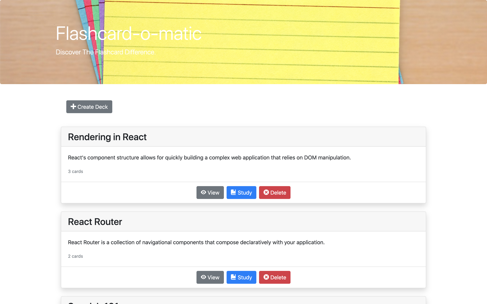

# Flashcards App

This application was created in the Thinkful Software Engineering Flex program. This project demonstrates my knowledge of hooks, state management, routes and API

The application allows teachers to create, update, read and delete decks of flashcards. Students can view the decks or study the decks.

## Built With

- React.js
- Bootstrap
- JSX
- Javascript

## Deployment

- [Flashcards App](https://flashcards-wine.vercel.app/)

